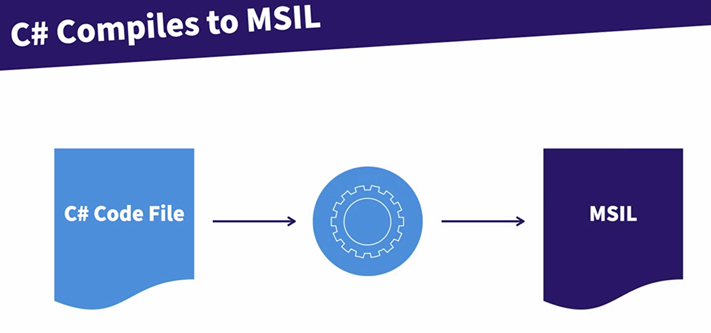

C# code file compiles to MSIL (Microsoft Intermediate Language)

All .NET languages compile to MSIL


Use ILDASM to open the dlls

.NET runtime is responsible to run the MSIL or the .NET executables

With recent .NET Core runtime, you can run your program in Windows, Linux and Mac os platforms

Base Class Library
- Dates
- Math
- Strings
- File IO
- Data access
- TCP
- SMTP
- HTTP
- Arrays


Nuget packages
- Nuget.org is a platform to provide the versioning, developer information, library
- Nuget package manager can help create the library and install them in a project

`struct` type cannot inherit from base struct

`record` type from C# 9 fast gaining attractions, is useful for microservices and multilayer applications. Use it for immutable objects

```
public class Employee: IPerson
{
    public string FirstName { get; set; }
    public string LastName { get; set; }
    public int Id { get; set ; }

    <!-- public Employee() -->
    <!-- { -->
<!--  -->
    <!-- } -->

    public Employee(string firstName, string lastName)
    {
        FirstName = firstName;
        LastName = lastName;
    }
}

public class Manager: Employee,IPerson
{
    public Manager():base("unknown","unknown")
    {

    }
    public int NumberOfDirectReports{get;set;}
}
```

One class can inherint multiple interfaces but one base class. Base class must have a default constructor (line 39-40). Other way to fix the compiling error is having line 53-56. Line 53-56 don't mean the program works, but just compiling.